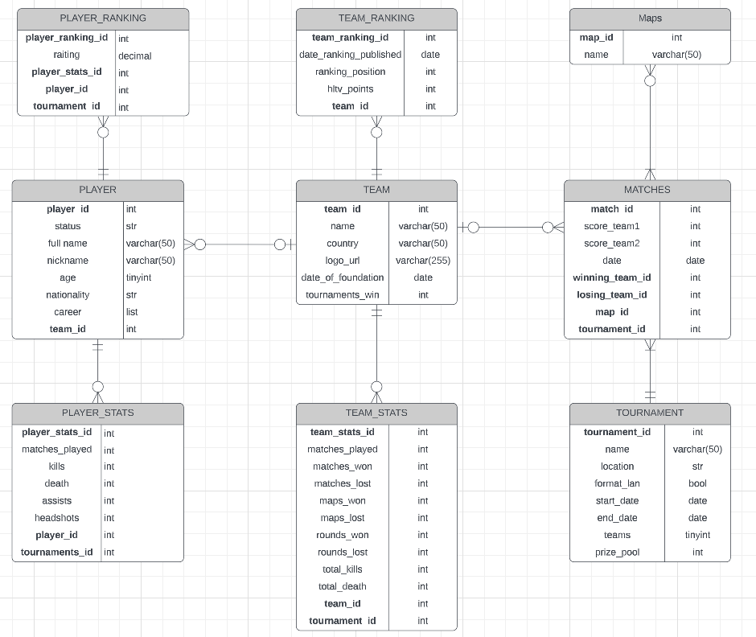

# Data_Base_Project
**База Данных на основе статистики профессиональных игроков и команд игры СS:GO.**

*Цель проекта: Освоение и использование знаний полученных на курсе «Базы Данных» во время проектирования собственной БД.*

**Концептуальная модель БД**:

- Предметная область.
  - Игровая статистика профессиональных игроков и команд по дисциплине СS:GO, матчи и турниры. Проектирование и получение статистики было основано по сайту [hltv.org](https://www.hltv.org/)
  
- Cущности.

  - Игрок (PLAYER)
  - Статистика игрока (PLAYERн_STATS)
  - Ранк игрока (PLAYER_RANKING)
  - Команда (TEAM)
  - Статистика команды (TEAM_STATS)
  - Ранк команды (TEAM_RANKING)
  - Турнир (TOURNAMENT)
  - Матч (MATCHES)
  - Карта (MAPS)
 
- Взаимосвязь между сущностями.

  - Игрок и Статистика игрока: один-ко-многим (Один игрок может иметь разные статистики, статистики изменяются от турнира к турниру, но каждая запись относится только к одному игроку)
  - Игрок и Ранк игрока: один-ко-многим (Один игрок может иметь несколько записей в ранке игрока, но каждая запись относится только к одному игроку)
  - Игрок и Команда: многие-к-одному (Один игрок может играть только за одну команду, но в одной команде может быть много игроков)
  - Команда и Статистика команды: один-ко-многим (Одна команда может иметь несколько записей в статистике команды, но каждая запись относится только к одной команде)
  - Команда и Ранк команды: один-ко-многим (Одна команда может иметь несколько записей в ранке команды, но каждая запись относится только к одной команде)
  - Команда и Матчи: один-ко-многим (Одна команда может участвовать в нескольких матчах, но каждый матч имеет только одну победившую и проигравшую команды)
  - Турнир и Матчи: один-ко-многим (Один турнир может иметь несколько записей в матчах, но каждый матч относится только к одному турниру)
  - Карт и Матч: многие-ко-многим (в рамках одного матча может быть много карт и также каждая карта может принадлежать многим матчам)

**Логическая модель**
  
  Уже имеющую концептуальную модель заполняем атрибутами, описание которых более подробно будет представлено в физической модели.

 

**Физическая модель**  [Physical-model](https://docs.google.com/spreadsheets/d/1yo6RClahy4RJ7r3Jy74mfjDkYZRGXRX0-Atwbbz9tcE/edit#gid=0)
  
  - Выбор 3НФ обоснован, тем что:
  
    - Избежание избыточности данных: 3НФ требует, чтобы каждый атрибут был зависим только от первичного ключа и не зависел от других атрибутов. Это позволяет избежать дублирования данных и сохранить их целостность.
    - Уменьшение размера таблиц: 3НФ позволяет разбить таблицу на более мелкие, что упрощает поиск и обработку данных.
    - Улучшение производительности: таблицы, находящиеся в 3НФ, обычно имеют меньший размер, что ускоряет выполнение запросов к базе данных.
    - Лучшая поддержка изменений: при использовании 3НФ изменения в одной таблице не затрагивают данные в других таблицах, что упрощает поддержку и модификацию базы данных.
   
  - Использование БД:
 
Данная база данных может использоваться для хранения и анализа статистики игроков и команд, участвующих в турнирах по компьютерным играм. Она может быть полезна для организаторов турниров, тренеров и игроков, которые могут использовать ее для анализа своих результатов и разработки стратегий для будущих игр. Также база данных может быть использована для проведения аналитических исследований в области компьютерных игр и электронного спорта.
